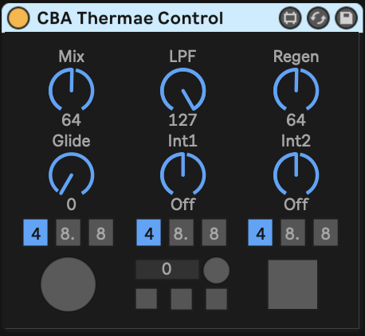
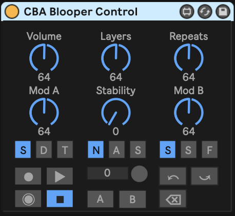

# Welcome to Max Bliss

Max Bliss is a collection of Max for Live (M4L) devices which can be used to 
control Chase Bliss effects pedals over MIDI. These devices are designed to mimic
the look and feel of the pedals in order to be instantly familiar to most users.

# Reason for Existing

These devices were conceived to overcome a few issues I had when using the pedals
via MIDI:

* It was difficult to remember (and inconvenient to look up) the CC numbers and 
   and valid values for each pedal function.
* Setting the CC values using Live's automation or other CC-enabled M4L devices
   broke the creative feel of using the pedals.
* Some of the functions did not operate the way I had hoped; for example the 
   stomp buttons could not be set independently of each other, so you couldn't set
   one without knowing what state the other should be in at the same time.

# Devices

The collection currently contains the following devices:

## CBA MOOD Control

CBA MOOD Control provides access to the knobs, switches and buttons on the top of the MOOD micro looper.

## CBA Thermae Control

CBA Thermae Control provides access to the knobs, switches and buttons on the top of the Thermae analog delay.

## CBA Blooper Control

CBA Blooper Control provides access to the knobs, switches and buttons on the top and front of the Blooper bottomless looper.

## CBA Common (comming soon)

CBA Common provides access to functions common to several pedals, such as exptression control, MIDI clock ignore and effect bypass. These are (ironically) not often needed (at least by me) when using the pedal over MIDI since their function is somewhat redundant. By placing them in their own device they can be omitted expcept when necessary.

# Support

These devices are provided as-is and there is no official support. However, if you think you have found a bug, or if you have a feature request, please open a new issue if one doesn't already exist.

:warning: These devices are currently a work in progress and should be treated as such. It's possible that newer versions may be incompatible with previous versions so upgrade your Live Set with caution.
